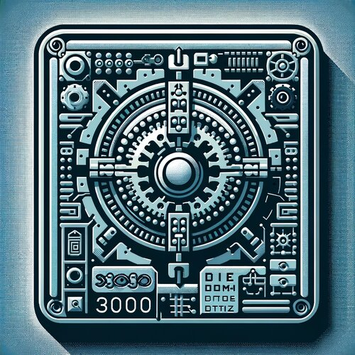
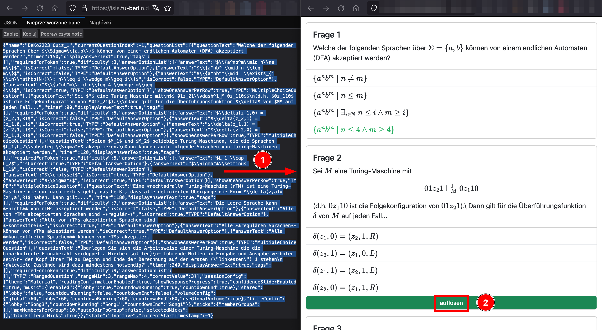

# Beko Quiz DTM

Web-App, die die Modulkonferenzquizze im bereitgestellten JSON-Format in ein leserliches Dokument umwandelt, welches im Browser optional auch als PDF-Datei "gedruckt" werden kann.
Dazu einfach den JSON-Code 1:1 aus ISIS in das Textfeld eintragen. Neben der leserlichen Darstellung hat man auch die Möglichkeit sich die Antworten anzeigen zu lassen (2).

_Logo erstellt mit OpenAI DALLE-3_

